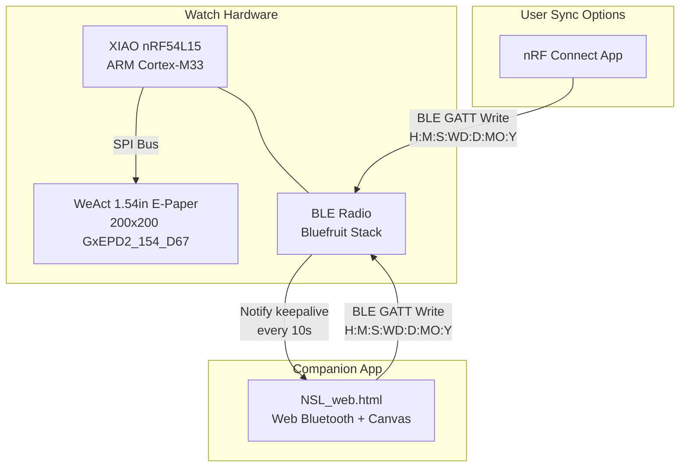
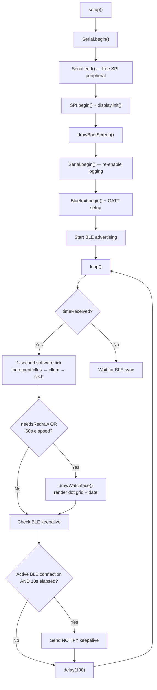
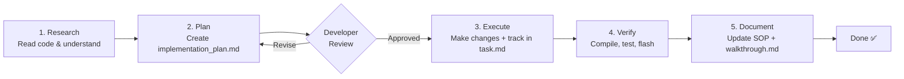

# NSL Watch — Technical SOP & System Documentation

> **Document Version**: 1.0  
> **Last Updated**: 2026-07-22  
> **Maintainer**: NSL Watch Team  
> **Status**: Active

> [!NOTE]
> This is a **living document**. Update it every time a new feature is added, wiring changes, or the BLE protocol is modified. Use the [Changelog](#changelog) at the bottom to track all revisions.

---

## Table of Contents

1. [System Overview](#1-system-overview)
2. [Hardware Specifications](#2-hardware-specifications)
3. [Pin Wiring Reference](#3-pin-wiring-reference)
4. [Software Architecture](#4-software-architecture)
5. [BLE Protocol Specification](#5-ble-protocol-specification)
6. [Firmware Reference](#6-firmware-reference)
7. [Web Companion App Reference](#7-web-companion-app-reference)
8. [Build & Flash Procedure](#8-build--flash-procedure)
9. [AI-Assisted Development Workflow (SOP)](#9-ai-assisted-development-workflow-sop)
10. [Adding New Features (Template)](#10-adding-new-features-template)
11. [Troubleshooting](#11-troubleshooting)
12. [Changelog](#12-changelog)

---

## 1. System Overview



### Key Design Principles

| Principle | Implementation |
|-----------|---------------|
| **Ultra-low power** | E-paper hibernates between 60s redraws; BLE advertising only |
| **Offline-first** | Software clock ticks locally after initial BLE sync |
| **24-hour time** | Both firmware and web app use 24h format (0–23) throughout |
| **Dot-matrix aesthetic** | Custom 5×7 font rendered as circles on a 20×17 grid |

---

## 2. Hardware Specifications

| Component | Model | Specification |
|-----------|-------|---------------|
| Microcontroller | Seeed XIAO nRF54L15 | ARM Cortex-M33, BLE 5.4, 1.5MB Flash, 256KB RAM |
| Display | WeAct 1.54" E-Paper | 200×200px, black/white, SPI, driver: SSD1681 (GxEPD2_154_D67) |
| Arduino Core | lolren/nrf54-arduino-core | v0.6.x |
| Display Library | GxEPD2 | BW variant |
| BLE Stack | Adafruit Bluefruit (compat) | bluefruit.h API |

---

## 3. Pin Wiring Reference

```
  XIAO nRF54L15          WeAct 1.54" E-Paper
  ┌──────────────┐        ┌───────────────┐
  │ PIN_D0  (D0) ├───────►│ BUSY          │
  │ PIN_D1  (D1) ├───────►│ CS            │
  │ PIN_D2  (D2) ├───────►│ DC            │
  │ PIN_D3  (D3) ├───────►│ RES           │
  │ PIN_SPI_SCK  ├───────►│ SCK (CLK)     │
  │ PIN_SPI_MOSI ├───────►│ MOSI (DIN)    │
  │ 3V3          ├───────►│ VCC           │
  │ GND          ├───────►│ GND           │
  └──────────────┘        └───────────────┘
```

| Signal | nRF54L15 Pin | E-Paper Pin | Notes |
|--------|-------------|-------------|-------|
| BUSY | `PIN_D0` | BUSY | Active HIGH while display is refreshing |
| CS | `PIN_D1` | CS | Chip select, active LOW |
| DC | `PIN_D2` | DC | Data/Command select |
| RES | `PIN_D3` | RES | Hardware reset, active LOW |
| SCK | `PIN_SPI_SCK` | CLK | SPI clock |
| MOSI | `PIN_SPI_MOSI` | DIN | SPI data in |

> [!WARNING]
> **nRF54L15 Constraint**: `Serial.end()` **must** be called before `SPI.begin()` due to a shared peripheral conflict on the lolren core. This is handled in `setup()`.

---

## 4. Software Architecture

### File Structure

```
watchface/
├── NSL_Watch_nRF54L15.ino    ← Main firmware (Arduino sketch)
├── NSL_Watch_Technical_SOP.md ← This document
└── web_app/
    ├── NSL_web.html           ← Companion app (Web Bluetooth)
    └── NSL_web.html.txt       ← Backup copy
```

### Firmware Architecture



### Display Rendering

The watchface uses a **20-column × 17-row dot grid** with a **5×7 pixel font**:

```
Grid Layout (200×200 canvas):
┌────────────────────────────────────────┐
│  Ghost dot grid (20×17)                │
│                                        │
│    col 4-8      col 11-15              │
│    ┌─────┐      ┌─────┐               │
│    │ H1  │      │ H2  │  ← rows 1-7   │
│    │     │      │     │    (hours)     │
│    └─────┘      └─────┘               │
│                                        │
│    ┌─────┐      ┌─────┐               │
│    │ M1  │      │ M2  │  ← rows 10-16 │
│    │     │      │     │    (minutes)   │
│    └─────┘      └─────┘               │
│                                        │
│        WED 15 JUN 2026                 │
│        ↑ date text at y=192            │
└────────────────────────────────────────┘
```

| Constant | Value | Purpose |
|----------|-------|---------|
| `DOT_R` | 4 | Circle radius (pixels) |
| `STEP` | 10 | Grid spacing (pixels) |
| `GRID_COLS` | 20 | Columns in dot grid |
| `GRID_ROWS` | 17 | Rows in dot grid |
| `ORIG_X` | 5 | Grid X origin |
| `ORIG_Y` | 5 | Grid Y origin |
| `D1_COL` | 4 | Tens digit start column |
| `D2_COL` | 11 | Units digit start column |
| `H_ROW` | 1 | Hours start row |
| `M_ROW` | 10 | Minutes start row |

---

## 5. BLE Protocol Specification

### Service & Characteristic

| Attribute | UUID | Properties |
|-----------|------|------------|
| **Time Service** | `aa9a7856-3412-3412-3412-341278563412` | — |
| **Time Characteristic** | `ab9a7856-3412-3412-3412-341278563412` | WRITE, WRITE_NO_RESP, NOTIFY |

### Write Packet Format

```
Format:  H:M:S:WD:D:MO:Y
Example: 14:35:00:3:15:6:2026
```

| Field | Range | Description |
|-------|-------|-------------|
| `H` | 0–23 | Hours (24-hour format) |
| `M` | 0–59 | Minutes |
| `S` | 0–59 | Seconds |
| `WD` | 0–6 | Weekday (0 = Sunday) |
| `D` | 1–31 | Day of month |
| `MO` | 1–12 | Month (1 = January) |
| `Y` | 2000–9999 | Full year |

### Encoding

- **Write**: UTF-8 text, max 32 bytes
- **Notify** (keepalive): 1-byte payload = current minute value, sent every 10 seconds

### Connection Behavior

| Event | Firmware Action |
|-------|----------------|
| Connect | Stores connection handle, logs to Serial |
| Write received | Parses time string, updates clock, triggers immediate redraw |
| Notify keepalive | Sends 1-byte ping every 10s to prevent Android GATT timeout (error `0x08`) |
| Disconnect | Restarts BLE advertising immediately |

### Advertising Configuration

| Parameter | Value |
|-----------|-------|
| Device name | `NslWatch` |
| TX power | 4 dBm |
| Fast interval | 32 (20ms units) |
| Slow interval | 244 (152.5ms) |
| Fast timeout | 30 seconds |
| Auto-restart on disconnect | Yes |

---

## 6. Firmware Reference

### Clock State Structure

```cpp
struct {
  int h=10, m=25, s=0, wd=1, d=27, mo=4, y=2026;
} clk;
```

### Timing

| Timer | Interval | Purpose |
|-------|----------|---------|
| Software clock tick | 1 second | Increments `clk.s` → `clk.m` → `clk.h` |
| Display redraw | 60 seconds | Full e-paper refresh with current time |
| BLE notify keepalive | 10 seconds | Prevents Android GATT disconnection |
| Main loop delay | 100 ms | Power-friendly polling interval |

### Power States

| State | Description |
|-------|-------------|
| **Active** | E-paper refreshing (~2s per full update) |
| **Hibernate** | E-paper in deep sleep, MCU running loop with BLE |
| **Boot** | Shows "Waiting BLE..." until first time sync |

---

## 7. Web Companion App Reference

### Technology

| Layer | Technology |
|-------|-----------|
| BLE | Web Bluetooth API (`navigator.bluetooth`) |
| UI rendering | HTML5 Canvas (200×200, scaled to 150×150) |
| Fonts | Google Fonts: Share Tech Mono, Rajdhani |
| Styling | CSS custom properties (dark theme) |

### Features

| Feature | Description |
|---------|-------------|
| Live clock display | Shows current system time, updates every 1s |
| Canvas preview | Pixel-accurate mirror of the e-paper dot grid |
| Manual sync | Button to send current time to watch |
| Auto-sync | Sends time every 60 seconds while connected |
| Connection status | Visual indicator (green dot / red dot) |
| Event log | Timestamped log of BLE events |

### Browser Compatibility

| Browser | Support |
|---------|---------|
| Chrome (Desktop) | ✅ Supported |
| Chrome (Android) | ✅ Supported |
| Edge (Chromium) | ✅ Supported |
| Safari | ❌ No Web Bluetooth |
| Firefox | ❌ No Web Bluetooth |

---

## 8. Build & Flash Procedure

### Prerequisites

1. **Arduino IDE** 2.x or Arduino CLI
2. **Board package**: Add `lolren/nrf54-arduino-core` via Boards Manager
3. **Libraries** (via Library Manager):
   - `GxEPD2` by Jean-Marc Zingg
   - `Adafruit Bluefruit nRF52` (or equivalent compat layer in lolren core)

### Build Steps

```bash
# 1. Select board in Arduino IDE
#    Board: XIAO nRF54L15 (lolren core)

# 2. Verify/Compile
#    Sketch → Verify/Compile  (or Ctrl+R)

# 3. Connect XIAO via USB-C

# 4. Upload
#    Sketch → Upload  (or Ctrl+U)
```

### First-Time Sync

1. Open `web_app/NSL_web.html` in Chrome
2. Click **⬡ Connect to Watch**
3. Select `NslWatch` from the Bluetooth device list
4. Time syncs automatically — watch display updates immediately

### Alternative Sync (nRF Connect)

1. Install **nRF Connect** on Android/iOS
2. Scan → Connect to `NslWatch`
3. Find characteristic `ab9a7856-...`
4. Write (UTF-8): `14:35:00:3:15:6:2026`

---

## 9. AI-Assisted Development Workflow (SOP)

This section defines the **Standard Operating Procedure** for making changes to the NSL Watch project using AI-assisted development.

### Phase 1: Research

| Step | Action | Output |
|------|--------|--------|
| 1.1 | Describe the desired feature/fix to the AI assistant | Feature description |
| 1.2 | AI reads all relevant source files | Codebase understanding |
| 1.3 | AI identifies affected components (firmware, web app, wiring, protocol) | Impact analysis |

> [!TIP]
> Always share the relevant `.ino` file and web app file with the AI. Mention any new hardware components.

### Phase 2: Plan

| Step | Action | Output |
|------|--------|--------|
| 2.1 | AI creates `implementation_plan.md` with proposed changes | Plan document |
| 2.2 | AI flags open questions, design decisions, and breaking changes | Review items |
| 2.3 | Developer reviews plan and resolves open questions | Approved plan |

> [!IMPORTANT]
> **Never skip the review step.** Firmware changes cannot be easily rolled back once flashed to hardware.

### Phase 3: Execute

| Step | Action | Output |
|------|--------|--------|
| 3.1 | AI creates `task.md` to track progress | Task tracker |
| 3.2 | AI makes code changes, updating task list as it goes | Modified source files |
| 3.3 | AI ensures firmware and web app remain in sync (UUIDs, protocol, constants) | Consistency check |

### Phase 4: Verify

| Step | Action | Output |
|------|--------|--------|
| 4.1 | Compile firmware in Arduino IDE (no errors/warnings) | Build success |
| 4.2 | Open web app in Chrome, verify canvas rendering | Visual verification |
| 4.3 | Flash firmware to watch, test BLE connection + time sync | Hardware verification |
| 4.4 | Verify e-paper display shows correct time and date | End-to-end test |

### Phase 5: Document

| Step | Action | Output |
|------|--------|--------|
| 5.1 | AI creates `walkthrough.md` summarizing what changed | Change summary |
| 5.2 | Update this SOP document: add new features, update diagrams | Updated SOP |
| 5.3 | Add entry to the [Changelog](#12-changelog) | Changelog entry |

### Workflow Diagram



---

## 10. Adding New Features (Template)

Use this template when planning a new feature. Copy it into your `implementation_plan.md`:

```markdown
## Feature: [Feature Name]

### Description
[What does this feature do?]

### Affected Components
- [ ] Firmware (`NSL_Watch_nRF54L15.ino`)
- [ ] Web App (`web_app/NSL_web.html`)
- [ ] BLE Protocol (new service/characteristic?)
- [ ] Hardware (new wiring/components?)
- [ ] This SOP document

### Firmware Changes
[Describe what changes in the .ino file]

### Web App Changes
[Describe what changes in the .html file]

### BLE Protocol Changes
[Any new UUIDs, packet formats, or behaviors?]

### New Constants
| Name | Value | Purpose |
|------|-------|---------|

### Testing Plan
1. [ ] Compiles without errors
2. [ ] Web app renders correctly
3. [ ] BLE connection works
4. [ ] E-paper displays correctly
5. [ ] [Feature-specific test]
```

### Feature Ideas Backlog

> [!NOTE]
> Add future feature ideas here as they come up. Move them to an `implementation_plan.md` when ready to build.

| # | Feature | Priority | Status | Notes |
|---|---------|----------|--------|-------|
| 1 | — | — | — | — |

---

## 11. Troubleshooting

### Firmware Issues

| Problem | Cause | Solution |
|---------|-------|----------|
| SPI fails to initialize | Serial/SPI peripheral conflict | Ensure `Serial.end()` is called before `SPI.begin()` |
| Display shows nothing | Wiring issue or wrong driver | Check all 6 SPI connections; verify `GxEPD2_154_D67` driver |
| BLE not advertising | Stack init failure | Check `Bluefruit.begin()` return; ensure core version ≥ 0.6.x |
| `Serial.printf()` crashes | Not supported on lolren core | Use `Serial.print()` chains instead |
| Android disconnects after ~30s | GATT timeout | Ensure NOTIFY keepalive runs every 10s (already implemented) |

### Web App Issues

| Problem | Cause | Solution |
|---------|-------|----------|
| "Web Bluetooth not supported" | Wrong browser | Use Chrome (Desktop/Android) or Edge Chromium |
| Device not found in scan | UUID or name mismatch | Verify UUIDs and device name filter match firmware |
| Sync fails after connect | Characteristic not found | Check service UUID matches firmware's `TIME_SERVICE_UUID` |
| Canvas shows wrong time | JS clock issue | Canvas uses `Date()` — check system clock |

### BLE Debugging with nRF Connect

1. Open nRF Connect → Scanner → Filter by `NslWatch`
2. Connect → Expand service `aa9a7856-...`
3. Find characteristic `ab9a7856-...`
4. Verify properties show `WRITE`, `WRITE_NO_RESP`, `NOTIFY`
5. Write test value: `12:00:00:0:1:1:2026`
6. Watch should redraw immediately

---

## 12. Changelog

| Date | Version | Author | Changes |
|------|---------|--------|---------|
| 2026-07-22 | 1.0 | AI-Assisted | Initial SOP created. Fixed BLE UUID mismatch and device name filter in web app. Documented full system architecture, BLE protocol, wiring, build procedure, and AI development workflow. |

---

> [!TIP]
> **When adding a new feature**: Update the relevant sections above, add a row to the Feature Ideas Backlog (or move it to "Done"), and add a Changelog entry with the date and description.
